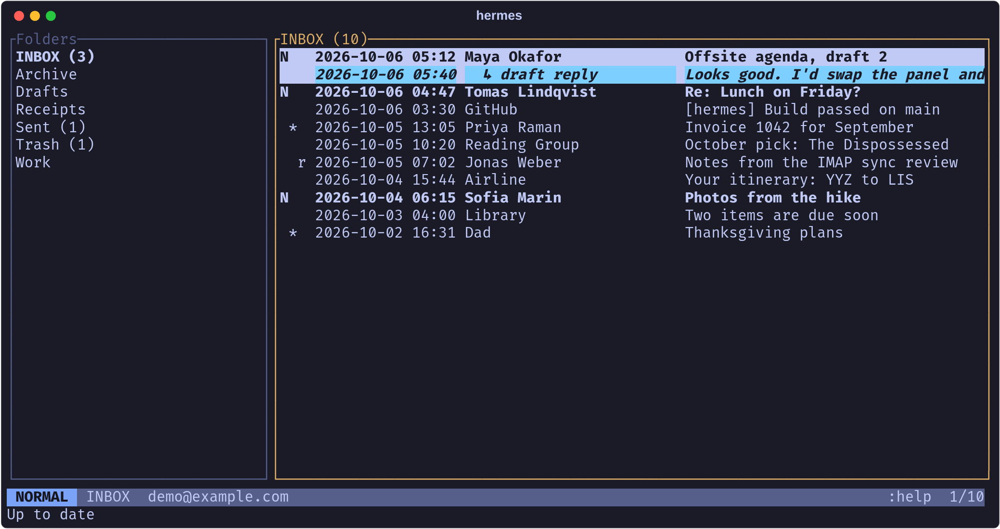
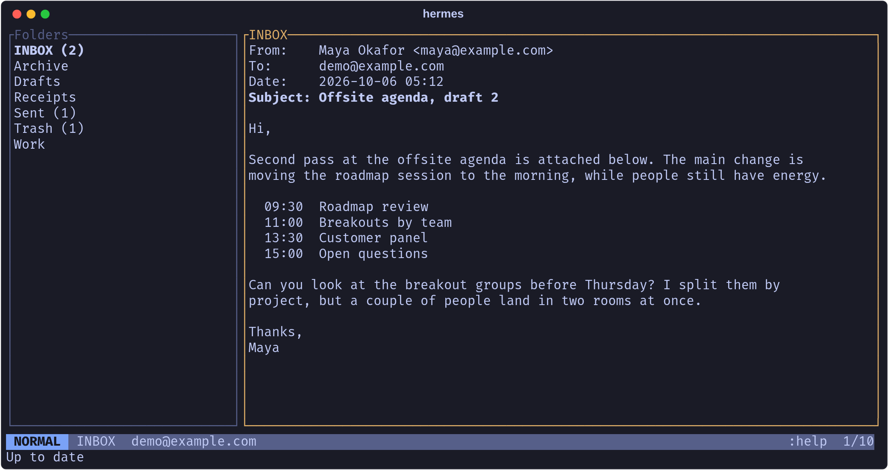
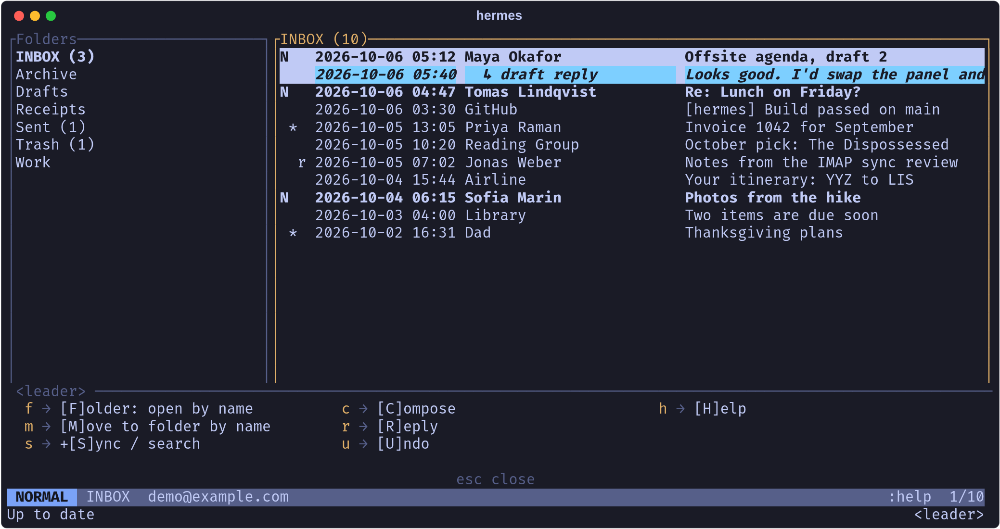
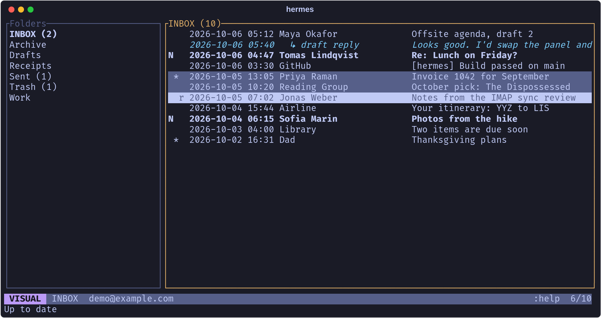
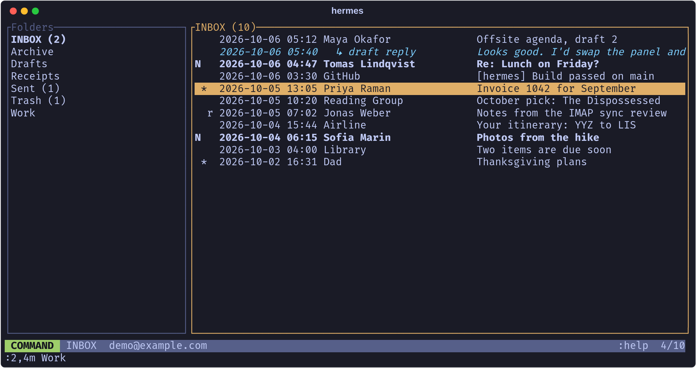

# Hermes

A modal, vim-style email client for the terminal, written in Rust.



Hermes uses IMAP and SMTP, keeps a full encrypted copy of your mailbox
on disk so it works offline, and is driven the way neovim is: normal,
visual and command modes, counts, ranges, a leader key and undo.

## Features

- **Modal editing for mail.** Folders are buffers and messages are lines:
  `dd`, `yy`/`p`, `u`, `V`, `/`, `:2,5m Work` all do what you would guess.
- **Full IMAP control.** Read, flag, star, move, copy, archive and delete
  messages; create, rename and delete folders; search on the server.
- **Offline mirror.** Every folder is synced into a local database,
  headers first and then bodies, in the background while you work.
- **Encrypted at rest.** The database is SQLCipher, unlocked by a
  password you type on every start. Nothing is stored in plain text.
- **Compose in your editor.** `o` and `r` open `$EDITOR` on a draft, then
  ask before sending.
- **Reply drafts in context.** A reply saved in your Drafts folder is
  listed under the message it answers.
- **Scriptable.** `hermes sync`, `list`, `read`, `send` and friends work
  from the shell.

## Install

Hermes builds with a recent stable Rust toolchain (edition 2024) and needs
the OpenSSL development files, which SQLCipher links against.

```sh
git clone https://github.com/a3l6/hermes.git
cd hermes
cargo install --path .
```

Or run it in place with `cargo run`.

## First run

```sh
hermes
```

The first start shows a setup form: your email address, the IMAP and SMTP
hosts (Gmail by default), your mail password, and a hermes password of
your choosing. For Gmail the mail password must be an
[app password](https://myaccount.google.com/apppasswords), not your normal
one.

Every later start asks only for the hermes password:


Hermes then connects and mirrors your mail in the background. The bottom
line shows progress, and you can read and act on what has already arrived.
On a large mailbox the first sync takes a while.

Ports default to 993 (IMAP) and 465 (SMTP). To change them, or to accept a
self-signed certificate with `insecure_tls = true`, edit
`~/.config/hermes/config.toml`.

## Using it

Hermes starts in normal mode with the folders on the left and the open
folder's messages on the right. `l` or `Enter` opens a message, `q` or
`:q` closes it.



Press `Space`, the leader key, and a popup lists what can follow. The same
popup appears for the other prefix keys (`g`, `z`, `d`, `y`, `Ctrl-w`).



`V` starts a visual selection; `d`, `y`, `a`, `m`, `~` and `s` then act on
every selected message.



`:` opens the command line. Commands take vim ranges, and `Tab` completes
folder names.



`:help` shows the whole keymap inside the app.

## Keys

| Moving | |
|---|---|
| `j` `k` `5j`, `gg` `G` `5G` `:5` | rows |
| `Ctrl-d` `Ctrl-u` `Ctrl-f` `Ctrl-b`, `H` `M` `L`, `zz` `zt` `zb` | paging and scrolling |
| `h` `l`, `Ctrl-w h/l/w` | folders pane / messages pane |
| `l`, `Enter` | open the folder or message under the cursor |
| `gt` `gT`, `:bn` `:bp`, `Ctrl-o` | next / previous / last-visited folder |
| `/text` `?text`, `n` `N` | search this list or the open message |

| Editing | |
|---|---|
| `dd` `3dd` `x` | delete (to Trash); `dd` in the folders pane deletes the folder |
| `yy`, `p` | yank messages, paste a copy into the open folder |
| `u` | undo the last delete, archive, move or flag change |
| `~`, `s` | toggle read, toggle star |
| `a`, `m` | archive, move (pick a folder, `Enter` confirms) |
| `o`, `r` | compose, reply in `$EDITOR` |
| `V` | visual mode: select rows, then `d` `y` `a` `m` `~` `s` or `:` |
| `R`, `:w` | sync every folder |

| Leader (`Space`) | |
|---|---|
| `Space f`, `Space m` | open / move to a folder by name (`Tab` completes) |
| `Space s m`, `Space s f` | sync every folder, search on the server |
| `Space c`, `Space r`, `Space u` | compose, reply, undo |
| `Space h` | help |

| Command | |
|---|---|
| `:q`, `:qa` (`ZZ`, `ZQ`) | close one layer (message, search results, hermes) / quit |
| `:e <folder>`, `:b <folder>` | open a folder |
| `:d`, `:y`, `:m <folder>`, `:archive` | delete, yank, move, archive |
| `:read`, `:unread`, `:star`, `:unstar` | set flags |
| `:mkdir <name>`, `:rename <name>`, `:rmdir` | create, rename, delete a folder |
| `:search <text>` | full-text search on the server |
| `:noh`, `:undo`, `:compose`, `:reply`, `:help` | |

Ranges work as in vim: `:%d`, `:2,5m Work`, `:'<,'>star`.

In the message list, `N` marks unread mail, `*` starred and `r` replied.

## Command line

```sh
hermes sync [folder]         # mirror one folder, or all of them
hermes folders               # list folders with unread counts
hermes list -f INBOX -n 20   # newest messages in the local copy
hermes read <uid>            # print a message
hermes search <text>         # full-text search on the server
hermes mv <uid> <folder>     # move a message
hermes rm <uid>              # delete a message
hermes send --to a@example.com --subject "Hi" --body "Hello"
```

These ask for the hermes password on the terminal. Set `HERMES_PASSWORD`
in the environment to skip the prompt in scripts; anyone who can read that
variable can open your mail, so use it deliberately.

## Storage and passwords

| File | Holds |
|---|---|
| `~/.config/hermes/config.toml` | Account settings, a salt and an Argon2id hash of the hermes password, used to reject a wrong one. No secrets. |
| `~/.local/share/hermes/<address>.db` | Every folder and message, and your mail password, in a SQLCipher database. |

The database key is derived from the hermes password with Argon2id and is
never written down; pages are decrypted in memory as they are read. If you
forget the hermes password, only the local copy is lost: delete both files
and set up again.

## Limits

- Password login only. There is no OAuth, so providers that require it
  (Outlook and Microsoft 365, for instance) will not work.
- One account.
- Attachments are listed by name but cannot be saved yet.
- HTML mail is shown as converted plain text.
- Hermes does not save drafts itself; it shows drafts written elsewhere.
- Sent mail is not copied to a Sent folder. Gmail does that on its own;
  other servers may not.
- New mail is polled once a minute rather than pushed.
- Undo finds a moved message again by its Message-ID, so a message without
  one, or one deleted for good, cannot be brought back. There is no redo.
- Folder names outside ASCII are shown in their raw IMAP encoding.

## Development

```sh
cargo test     # unit tests
cargo clippy
```

The source is small: `src/tui.rs` is the interface and the background sync
worker, `src/email_tools/remote.rs` is the IMAP layer, `src/store.rs` the
encrypted database, `src/login.rs` the setup and unlock forms, and
`src/config.rs` the settings and key derivation.
